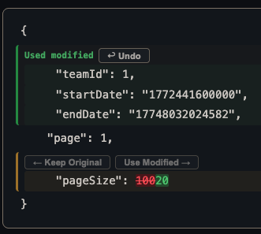
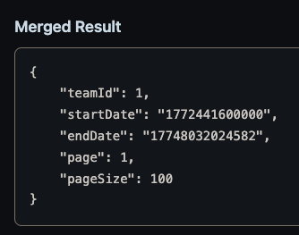

# Diff Checker

A text comparison tool in a single HTML file. No dependencies, no build step — just open it in a browser.

## Features

- **Real-time diff** — highlights changes as you type
- **Word-level precision** — shows exactly which tokens changed within a line
- **Merge controls** — accept or reject each change individually, or in bulk
- **Side-by-side & stacked views** — toggle between layouts
- **JSON formatting** — detects valid JSON and offers one-click pretty-print
- **Keyboard navigation** — `F7` / `Shift+F7` to jump between changes
- **Copy merged result** — one click to copy the resolved output
- **Single file, zero dependencies**

## Usage

Open `compare.html` in any browser. Paste text on both sides. That's it.

## Screenshots

