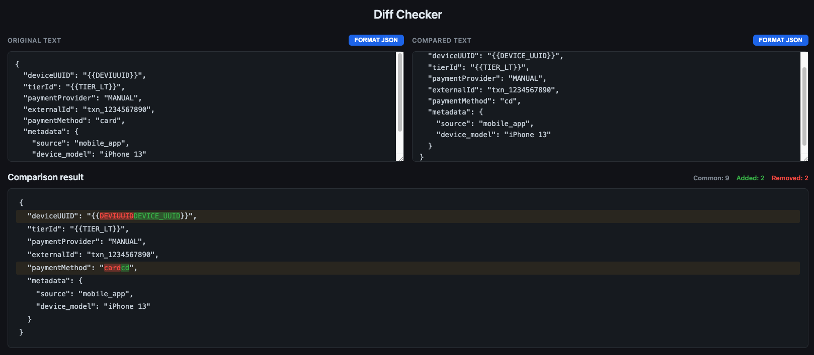
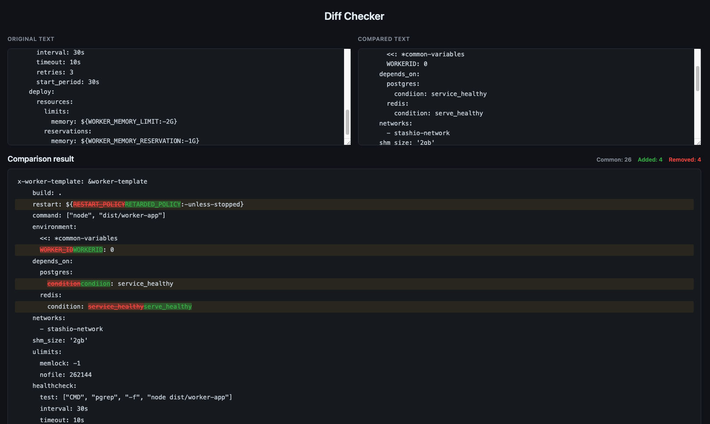

# Diff Checker

A simple text comparison tool that runs entirely in a single HTML file. No build tools, frameworks, or server required — just open it in a browser.

## Features

- **Real-time diff** — differences are highlighted as you type, no button click needed.
- **Line and word-level highlighting** — modified lines show exactly which words changed (red for deletions, green for additions).
- **JSON formatting** — automatically detects valid JSON and offers a one-click format button.
- **Zero dependencies** — plain HTML, CSS, and JavaScript in a single file.

## How to Use

1. Open `compare.html` in any web browser (double-click the file).
2. Paste or type text into the left and right text areas.
3. Differences appear instantly in the result section below.
4. If either input contains valid JSON, a **FORMAT JSON** button will appear above that text area.

## Screenshots

### JSON comparison with formatting

### General text comparison

